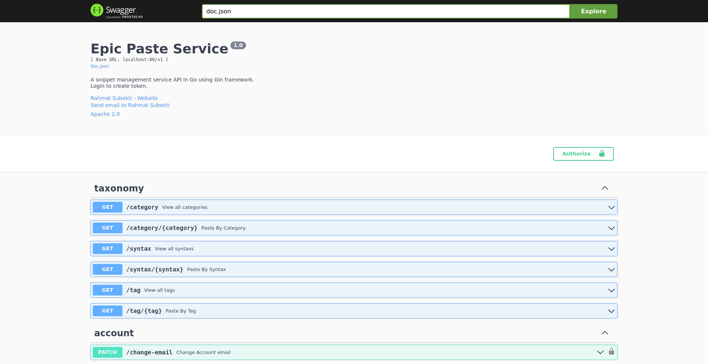

Epic Paste is simple note taking app for keeping code snippets. The snippet can be view privately or publicly by user who created it. Other user can only view public snippet when they list all the snippets from API.

This is only a backend app or an API, serving swagger ui api documentation on /docs/index.html.

## Feature
- User Authentication with Jwt token
- List Paste with Pagination
- List Paste By Tags, Category or Syntax
- View User Profile and their public snippet
- View private paste owned by authenticated user
- Change User Profile info

## Tech Stack and Framework
- Golang
- Postgresql
- GORM
- Gonic/GIN
- Swaggo/Swag

## Try the demo
You can run this as a container by pulling the images from  [`rmsubekti/epicpaste`](https://hub.docker.com/repository/docker/rmsubekti/epicpaste)  on your local computer or online development lab.

Default login:
- username : `epicpaster`
- password: `5uperSecret`

or you can register an account for yourself.

For other configuration see [`rmsubekti/epicpaste` on the dockerhub](https://hub.docker.com/repository/docker/rmsubekti/epicpaste).

### Try it on your local computer
1. Open a terminal
2. Create folder 
   ```
   mkdir epicpaste && cd epicpaste
   ```
3. Run this command on terminal
   ```
   wget https://rmsubekti.github.io/compose/epicpaste/compose.yml && docker compose up
   ```

### Try it on Docker Playground

1. Login to https://labs.play-with-docker.com/
2. Create new instance
3. Run on terminal 

   ```
   wget https://rmsubekti.github.io/compose/epicpaste/compose.yml && docker compose up
   ```
4. Click open port button and type `80`

To make swagger UI working properly, you need to replace `default hostname` with hostname generated by docker playground like so:

```
domain=longDomainNameGeneratedByDockerPlayGround.WithoutHTTPProtocol
sed -i -e "s/localhost/$domain/g" compose.yml && docker compose up
```  


## Demo Video 


