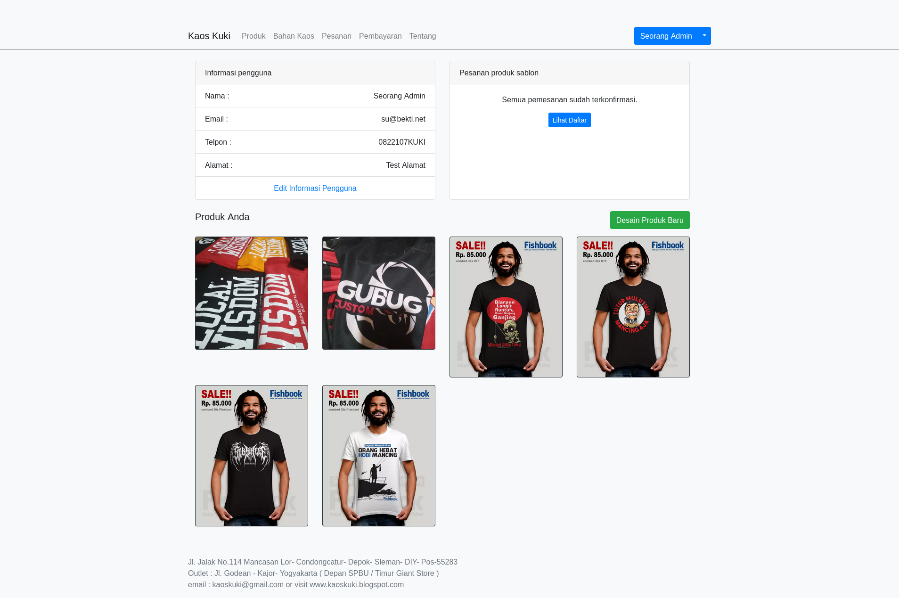
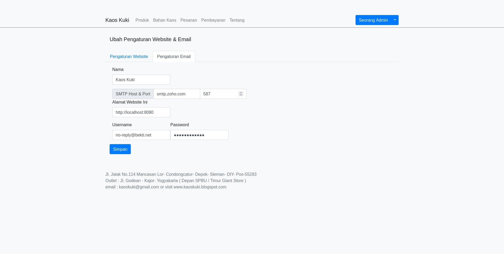

 Kaos Kuki is a web-based screen printing ordering system which is expected to facilitate the recording of orders and facilitate users in obtaining information and ordering clothes printing on CV. KaosKuki.

## Feature
- Multi role account (admin/consumer) with single login
- Product visibility (private/public), so consumer can showcase and sell their design
- Notification via email
- Account confirmation and forgot password
- Website Configuration (company name and SMTP email setting)
- Price calculation according to t-shirt size and printing size.

## Tech Stack and Framework
- Golang
- Postgresql
- GORM
- Gorilla Mux
- HTML
- CSS Bootstrap
- Javascript

## Try the demo
You can run this as a container by pulling the images from  [`rmsubekti/kaoskuki`](https://hub.docker.com/repository/docker/rmsubekti/kaoskuki)  on your local computer or online development lab.
Default admin login:
- email : `admin@mail.net`
- password: `5uperSecret`

For other configuration see [`rmsubekti/kaoskuki` on the dockerhub](https://hub.docker.com/repository/docker/rmsubekti/kaoskuki).

### Try it on your local computer

1. Open a terminal
2. Create folder 
   ```
   mkdir kaoskuki && cd kaoskuki
   ```
3. Run this command on terminal
   ```
   wget https://rmsubekti.github.io/compose/kaoskuki/compose.yml && docker compose up
   ```

### Try it on Docker Playground

1. Login to https://labs.play-with-docker.com/
2. Create new instance
3. Run this command on terminal
   ```
   wget https://rmsubekti.github.io/compose/kaoskuki/compose.yml && docker compose up
   ```
4. Click open port button and type `80`

## Website Configuration
 

In order for users to register an account, you need to change the configuration in the Email configuration tab as shown in the image above. At least by changing the website domain name `localhost` to the domain name used to serve this website.

## Demo Video 

